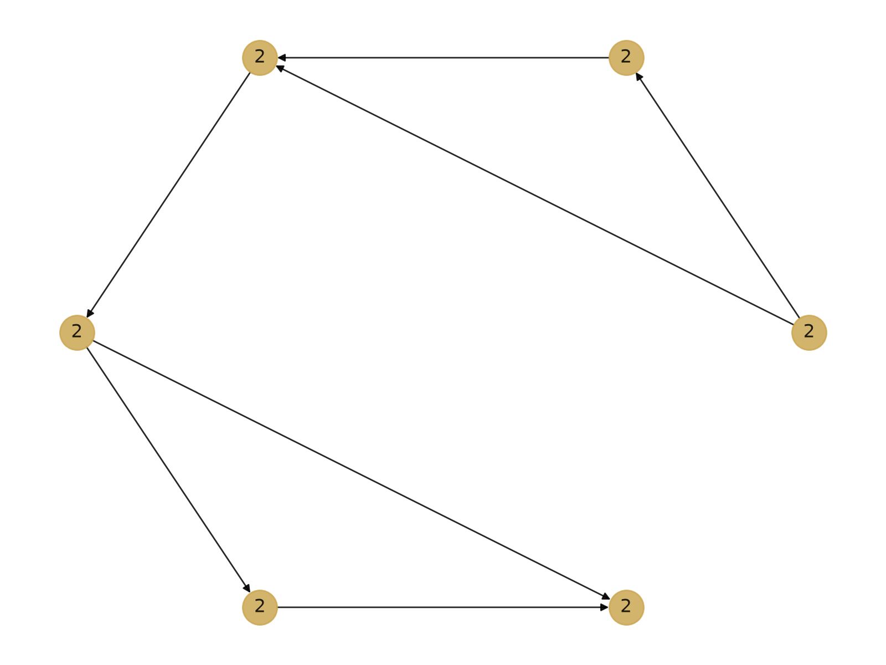
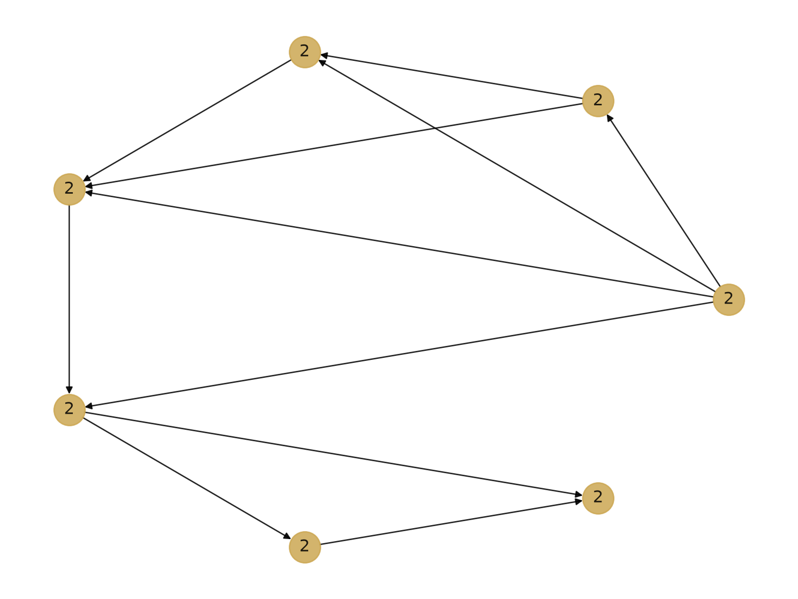
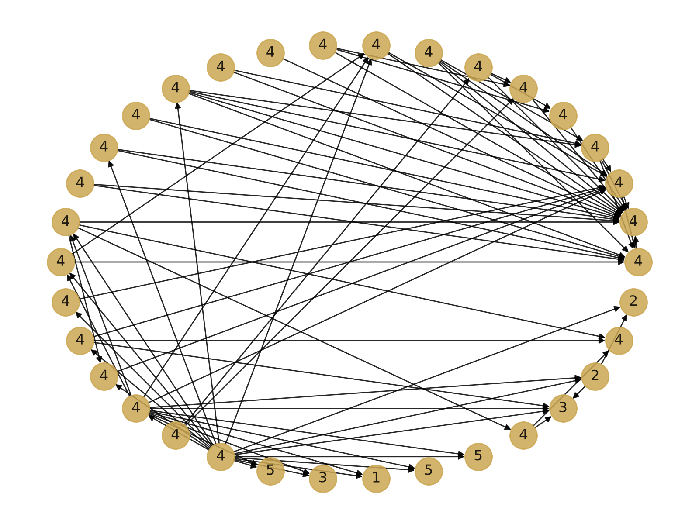

```
git clone https://github.com/RodrigoZonzin/data_science_ufsj.git
cd comunidades_redes
conda env create -f environment.yml
conda activate label_prop
python3 label_prop.py {nome do arquivo .csv}
```

### Rede 1 

### Rede 2

### Rede Zachary
